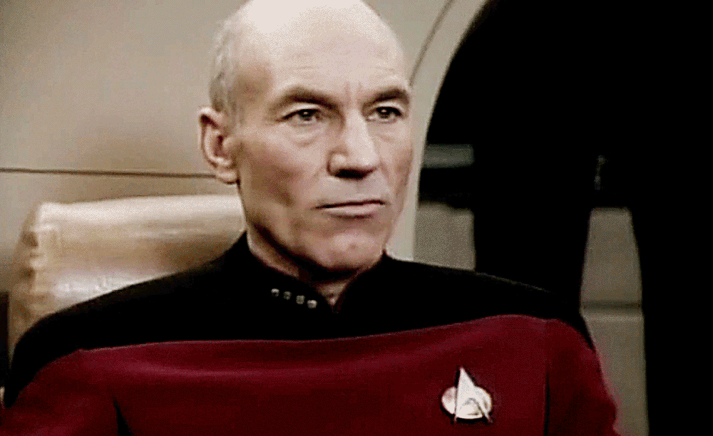

# Picard

---

## WTF this?

A really **REALLY** _boring_ blog "theme", yo. 

## TNG &hellip; WTH?

**BOOYAH!** Star Trek _fracking_ **ROCKS** son! 

## Demo?

Hey man, chillax, 'sall good. 

DEVELOPMENT | PRODUCTION
:-: | :-:
 | 

## ROTFLMAO @ ur design

Don't hate the playa, hate the game. 

## OMG, why `
` evrtng?

Left justification is so played out, everybody got it! 

---

Copyright &copy; [Micky Hulse](http://mhulse.com) 2013-2014. **All rights reserved.**

Unauthorized use and/or duplication of this material, without express and written permission from the owner, is strictly prohibited.

